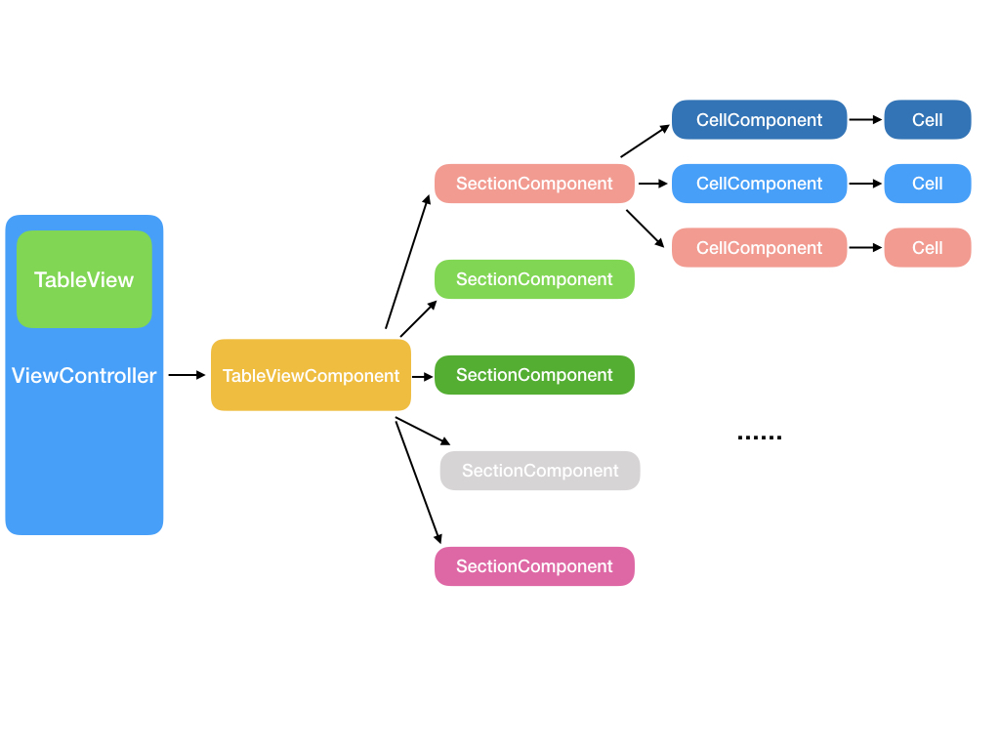
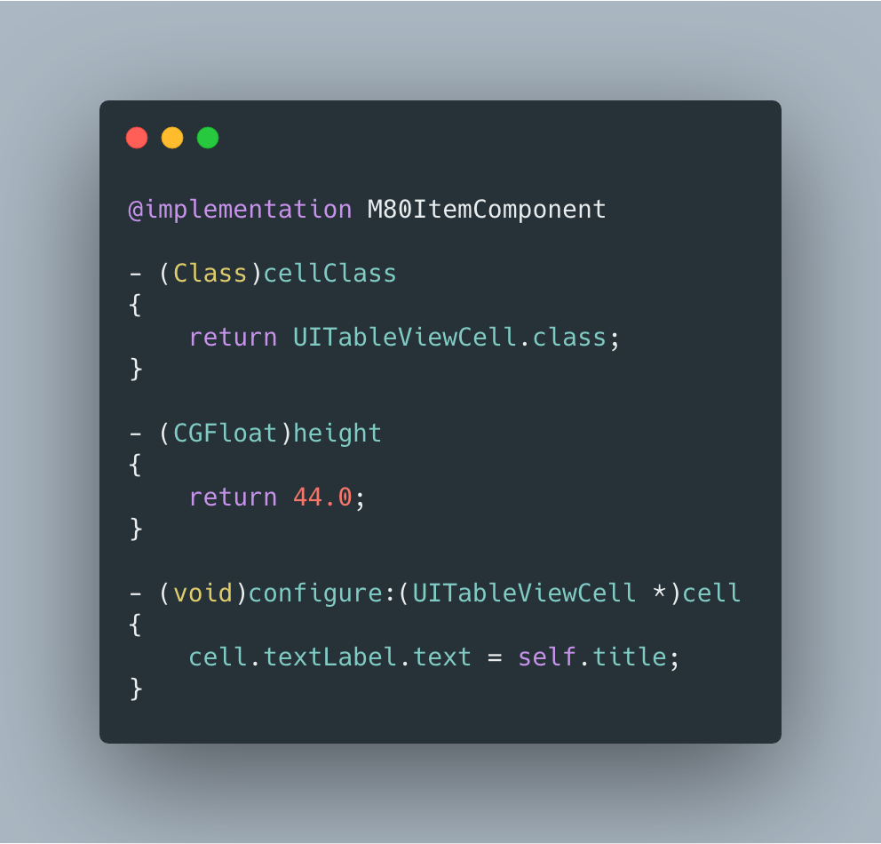
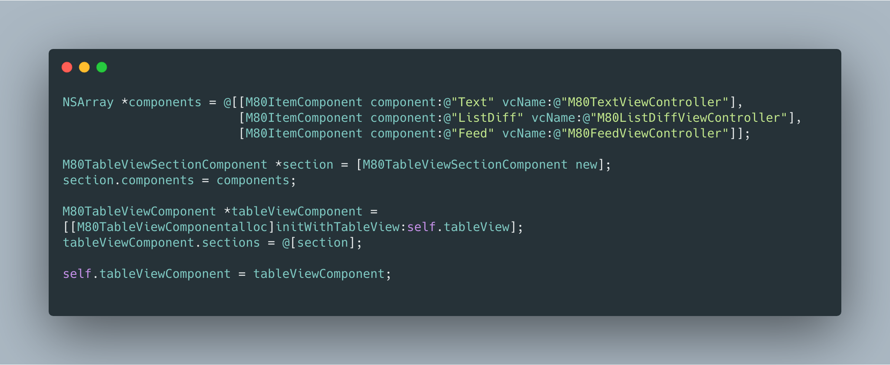

# UITableView 的问题

在 iOS 开发中，UITableView 可以说是最常用的控件了。几行代码，实现对应方法，系统就会给你呈现一个 60 帧无比流畅的列表，让初学者成就感爆棚。然而随着开发的深入，我们就会慢慢觉察到当前的 UITableView 实现会有这样那样的问题。

* 繁琐的重用流程

几乎所有 TableView Adapter 中都有如下的代码 `registerClass(Nib):forCellReuseIdentifier` 进行 cell 重用的注册，后续又需要使用 `dequeueReusableCellWithIdentifier:` 获取对应 cell ---- 写多了难免乏味。同时如何给 cell 设置一个有意义且不重复的 reuseIdentifier 又会成为众多强迫症程序员的烦恼之一。

* 不安全的 model 和 cell 映射关系

随着业务深入，一个 UITableView 往往会包含多种 model，对应就有多重不同的 cell，那么建立 model 和 cell 的映射关系就会非常蛋疼，无论是if else，switch，还是 map<model,cell> 都不是那么的优雅，每当 model 类型有所增删，开发者往往需要心惊胆战地检查各个实现方法里是否正确添加/删除了相应的映射关系。

* 单调的优化过程

业务继续深入，为了保证相关代码整洁，易于拓展和性能高效，除了维护 model 和 class 关系(`CellFactory`)外，我们往往需要引入不同类型的 adapter 做职责分离：`DataSource` 管理数据源，`LayoutManager` 管理排版和提供预计算高度能力，`CellHeightCache` 进行高度缓存，这种做法可以一定程度减轻代码膨胀的问题。但也不是完美的：套路都是一样的，即使你熟练掌握了这些所谓的设计原则，在实际操作中还是有大量的重复代码，写多了不免乏味。

* 数据源和 UI 并非绑定关系

当 model 变化时，我们往往需要通过当前 model 的位置反推出对应 cell 在 UITableView 中的位置(`indexPath`)，然后做相应的更新处理，反之亦然。但这部分工作无非是数组遍历，寻找 index，重复且繁琐，稍有不慎还有出错导致崩溃的可能。

# 组件化方案

为了解决如上问题，同时也受到 IGListKit 和 React.js 的启发，M80TableViewComponent 提出了一种组件化的解决方案，实现类似 React.js 的“单向数据绑定”功能，同时将大量的重复计算归纳在组件内部，上层使用者只需要根据当前业务创建相应组件并组合使用即可。

## 基础组件

为了实现整个 UITableView 的流程， M80TableViewComponent 引入三个基础组件：

* M80TableViewComponent
* M80TableViewSectionComponent
* M80TableViewCellComponent

顾名思义，他们分别对应 UITableView 中的 UITableView，Section 和 UITableViewCell。用前端技术做类比的话，M80TableViewComponent 就是我们定义的 VirtualDOM，而 UITableView 则是真正的 DOM：前者记录虚拟的层次结构，后者仍负责最终的渲染。具体关系参考下图：

## 简单使用

### 定义组件

一个简单的 M80TableViewComponent 定义如下

这是一个用于文本列表显示的组件，只实现最基本组件协议

* 当前组件对应何种 UITableViewCell：   - (Class)cellClass
* 当前组件对应的 UITableViewCell 高度是多少: - (CGFloat)height
* 如何通过当前组件配置 UITableViewCell: - (void)configure:(UITableViewCell *)cell

### 和 UITableView 联动

定义完组件后，我们只需要按照顺序将组件加入父组件中，即可完成和 UITableView 的绑定。 
 

具体效果详将 Example Project

## 特性

看了上述的使用方式后，你很可能将 M80TableViewComponent 当成一种固定数据源组装方式而已，并没有其他新意。事实上除了充当数据源外，它还有如下优势

### 单向绑定

当我们使用组件时，一旦当前 M80TableViewComponent 和 UITableView 关联，后续针对 M80TableViewComponent 的所有操作都会实时反应到 UITableView 之上，包括对 cell component 的移除，刷新，插入，以及 section component 的插入，移除，和刷新。我们不再需要繁琐的通过 controller 同时操作 view 和 model 以保证其一致性，只需要单纯操作 component 即可：component 根据自身层次结构计算对应 UI 层次结构，在修改 component 内部结构的同时也会自动获取到对应的 cell 对象进行修改。这样的做的好处是上层开发只需要关注 component 即可，而不再关心 indexPath 相关的计算过程，从而规避了一些常见的 indexPath 计算越界问题。

### 自动重用

每一个 M80TableViewCellComponent 在第一次被使用时都会通过 `M80TableViewComponentRegister` 根据上下文信息自动绑定 reuseIdentifier 和 cellClass 的关系，完成 cell 的重用。这里 M80TableViewCellComponent 会直接使用当前 cell component 的类名作为 reuseIdentifier，既能保证不与其他 cell 重名，又省去了取名之苦。

### 高度优化 和 ListDiff

在 iOS 中比较蛋疼的事情是如何判断两个对象相等：在不使用 runtime 的场景下，往往需要业务层添加大量冗余代码用于支持对象比较，而使用了 runtime 又会对业务侵入过多。在 M80TableViewComponent 中我们使用了一种不基于 runtime 且比较轻量的方法：

所有的 M80TableViewComponent 都可以遵循 M80ListDiffable 协议，以用于组件内部的一致性判断:

* - (NSString *)diffableHash;

默认情况下，每个 cell component 在初始化时都会有自己唯一的 cellIdentifier 作为 diffableHash。

这个协议有如下两个场景的应用

* 自动 cell 高度缓存
* 通过 ListDiff 算法实现的 section 局部刷新

在开启高度重用的选项(`cellHeightCacheEnabled`)时， M80TableViewComponent 计算 cell 高度后会自动记录 diffableHash 和 height 的对应关系。后续再次刷新 UITableView 时将自动获取对应的高度而不再需要额外计算。而当一个 cell 有多重状态，需要在不同状态下展示不同高度时，可以通过业务状态返回不同的 diffableHash 来高度切换。除了高度缓存外，M80TableViewComponent 也提供了一种简单的预计算高度的机制，在组装完 cell component 后，只需要简单调用基类方法 `measure` 就可以直接预计算高度以供后续使用。

适用 ListDiff 时，cell component 的 diffableHash 将做为唯一标识，判断 old components 和 new components 中各个 component 需要 hash 到哪些桶中，尔后将冲突桶中的 component 标记为 move，而不冲突桶中的 component 则为 add/remove。详细算法可参考 M80ListDiff 函数。在合适的场景下，使用 ListDiff 进行 section 的重新载入，而不是人工计算各种变化信息后逐个操作 component，能够在保证性能的前提下，保证高效的开发效率和合适的界面表现。

## 使用贴士

不同于以往构建 UITableView 的常见用法，使用 M80TableViewComponent 更推荐使用 **声明式** 而非 **命令式** 的做法进行使用。
落实到实际操作上

* 如果涉及单个 cell 的操作，直接使用 cell component 本身的方法，如 remove，reload 方法
* 涉及到单个 section 内 cell 变化，可以考虑每次重新 setComponents 或 reloadUsingListDiff
* 涉及到多 section 多 cell 变化，则可以重新组装所有 component，而不是不停增删各个 component，一方面这样做比较简单，不容易出错。另一方面 component 只是 ViewModel，再真正刷新前的批量操作并不会有过多的性能问题。

